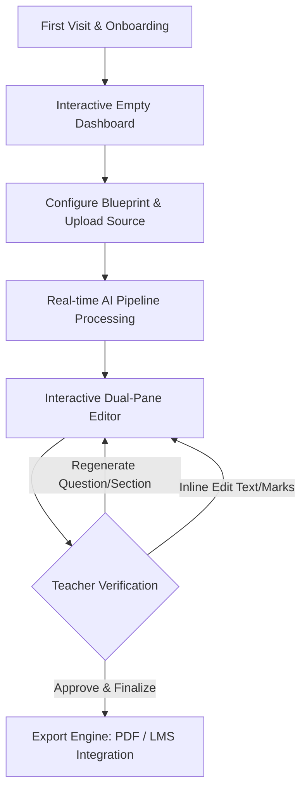
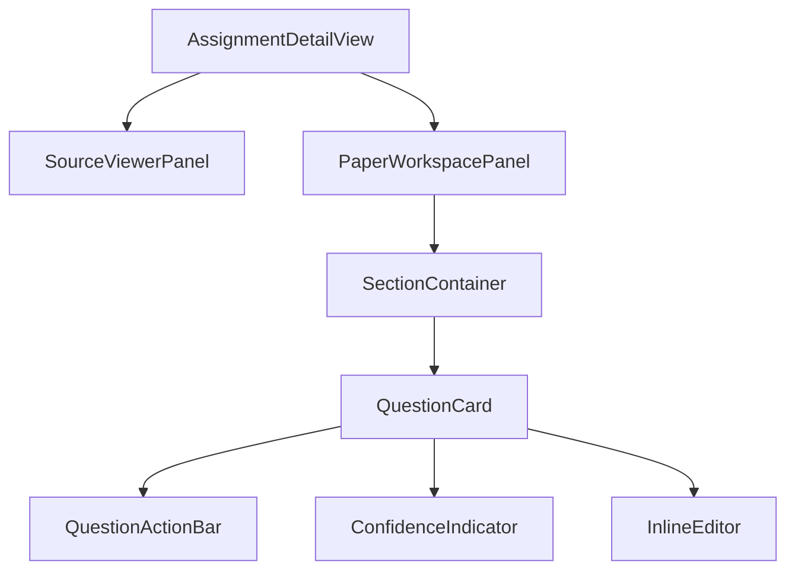
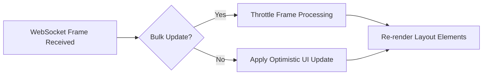

# QUESTORA: AI-POWERED ASSIGNMENT GENERATOR PLATFORM
## Production-Grade UI/UX System Design & Architectural Blueprint

This document defines the comprehensive UI/UX architecture for **QUESTORA**, a SaaS platform built to empower teachers, coaching institutes, and educational organizations to ingest materials and generate, review, edit, and export beautifully structured, pedagogically sound exam papers.

---

## 1. PRODUCT UX FLOW

The journey of an educator is defined by **limited time, high cognitive load, and the necessity of precision**. QUESTORA's UX flow is built on the **"Zero-Cold-Start"** and **"Human-in-the-Loop"** principles, ensuring teachers feel in complete control of the AI at every step.



### Step-by-Step Teacher Journey & UX Goals

#### A. First Visit & Onboarding
*   **UX Goal:** Deliver immediate proof of value without requiring complex setup.
*   **Design Pattern:** A sleek **Sandbox Card** sits prominently on the onboarding screen. Instead of reading documentation, teachers can choose a pre-loaded 1-page sample (e.g., *9th Grade Biology: Photosynthesis*) and click "Generate Sample Paper". Within 8 seconds, they witness a live dual-pane generation of a 3-question mini-test.
*   **Onboarding Tour:** A 3-step progressive coachmark guide highlighted with glassmorphism overlays pointing to:
    1.  *Source Upload* (Where the magic starts).
    2.  *Real-time AI Configuration* (How to control the AI's output).
    3.  *One-click PDF Export* (The final output).

#### B. The Empty Dashboard
*   **UX Goal:** Avoid the "blank canvas anxiety" that causes SaaS churn.
*   **Design Pattern:** An interactive dashboard featuring:
    *   **Preset Template Cards:** Ready-to-go structures such as *"Middle School CBSE Science Weekly Test"* or *"High School AP US History Midterm"*.
    *   **"Draft Recovery" Notification:** If a teacher drops off mid-generation, a subtle toast banner appears: *"Would you like to resume drafting your 10th Grade Algebra paper from yesterday at 04:15 PM?"*.

#### C. Assignment Creation Flow (The Input)
*   **UX Goal:** Reduce form fatigue and balance dynamic input parameters.
*   **Design Pattern:** A single-page, split-panel form.
    *   *Left Column:* Configuration parameters (Grade, Subject, Question Type Mix, Marks Distribution, PDF/Text Uploader).
    *   *Right Column (The Live Blueprint):* A visual representation of the paper's structural skeleton that updates dynamically as numbers are changed. If the teacher adjusts MCQs to "5 questions, 2 marks each", the visual skeleton instantly renders 5 placeholder blocks under a "Section A: Multiple Choice" header, displaying a total of `10/100 Marks`.

#### D. The AI Generation Phase
*   **UX Goal:** Eliminate user anxiety during long asynchronous processes and prevent the "frozen screen" illusion.
*   **Design Pattern:** The configuration panel transitions into a **Live Pipeline Tracker**. We utilize a visual pipeline timeline (Ingestion $\rightarrow$ Semantic Parsing $\rightarrow$ Question Synthesis $\rightarrow$ Pedagogical Guardrails $\rightarrow$ Final Typesetting). As the AI progresses, the corresponding node glows, and a micro-log updates below it (e.g., *"Parsing Page 3: Identified 'Cellular Respiration' as a high-density concept"*).

#### E. Reviewing & Refining the Generated Paper (The Dual-Pane Editor)
*   **UX Goal:** Provide high-density editing capability without losing the source context.
*   **Design Pattern:** A 50/50 split-screen layout on desktop:
    *   *Left Pane:* Scrollable Source Document (PDF/Text) with highlighted passages representing where generated questions were sourced.
    *   *Right Pane:* Interactive Exam Paper styled to look like an actual printed exam sheet.
    *   *Interaction:* Clicking a question in the right pane highlights the exact sentence/paragraph in the left pane source document that informed the AI, reinforcing trust.

#### F. Editing & Regeneration (Human-in-the-Loop)
*   **UX Goal:** Allow micro-adjustments without disrupting the entire layout.
*   **Design Pattern:** 
    *   **Inline Editing:** Double-clicking any text (question title, options, marks) immediately turns the field into an input box with auto-save.
    *   **Regenerate Selector:** Hovering over a question reveals an *"AI Actions Menu"*. The teacher can click *"Regenerate"* and choose quick modifiers: *"Make it harder"*, *"Convert to Short Answer"*, *"Change focus to 'Mitochondria'"*, or input a custom prompt.

#### G. Exporting & Distribution
*   **UX Goal:** Zero formatting adjustments post-export. What you see is *exactly* what prints.
*   **Design Pattern:** A full-screen **Print Preview Engine**. Controls in the top bar allow adjusting margins (Compact, Standard, Wide), font family (Georgia, Arial, Times New Roman), font size (10pt, 11pt, 12pt), and structural options (*"Include Student Info block"*, *"Generate Answer Key at the end"*, *"Double column layout"*). The exported PDF matches this preview pixel-for-pixel.

---

## 2. INFORMATION ARCHITECTURE

To optimize for teachers navigating on the move (classroom iPads, laptops, mobile phones), the navigation system relies on a **low-depth, high-visibility global hierarchy**.

### Next.js App Router Structure
```
src/app/
├── (auth)/
│   ├── login/
│   └── register/
├── (dashboard)/
│   ├── layout.tsx             # Collapsible global sidebar & top profile header
│   ├── page.tsx               # Active dashboard: Recent papers, templates, quick stats
│   ├── assignments/
│   │   ├── page.tsx           # Paginated and filtered historical papers
│   │   ├── create/
│   │   │   └── page.tsx       # Live creation form & blueprint panel
│   │   └── [id]/
│   │       ├── page.tsx       # Interactive Dual-Pane Editor & PDF compiler
│   │       └── analytics/
│   │           └── page.tsx   # Post-assignment statistics (optional)
│   ├── question-bank/
│   │   └── page.tsx           # Repository of approved questions for modular build
│   └── settings/
│       └── page.tsx           # Print defaults, school logo, default instructions
```

### Desktop Sidebar Layout (Global Navigation)
The sidebar is designed with three distinct zones: Brand/Context, Core Utilities, and User Context. It collapses to a compact icon-only bar on smaller screens (992px to 1200px) to maximize editing real estate.

```
+--------------------------------------------------+
|  [Q] QUESTORA                    [Collapse Arrow]| <- Brand Zone
+--------------------------------------------------+
|  + NEW ASSIGNMENT (Primary Action Button)        | <- Call to Action
+--------------------------------------------------+
|  (icon) Dashboard                                |
|  (icon) Assignments                              | <- Core Workflow Routes
|  (icon) Question Bank                            |
|  (icon) Uploaded Sources                         |
+--------------------------------------------------+
|  (icon) Templates & Blueprints                   | <- Administrative Zone
|  (icon) School Profile & Styling Settings        |
+--------------------------------------------------+
|  [User Profile Card: Mr. Jonathan]               | <- Account Context
+--------------------------------------------------+
```

### Global vs. Contextual Accessibility Rule
*   **Globally Accessible:** "New Assignment Creation", "Fuzzy Search across all papers", "System Settings", and "Recent Drafts".
*   **Contextually Isolated:** "Regenerate Question", "Add Section", "Adjust Margin Sizing", and "View Original PDF Highlight". These actions only appear when the teacher is inside a specific assignment editing route (`/assignments/[id]`), preventing clutter in the main layout.

---

## 3. DASHBOARD UI/UX DESIGN

The Questora Dashboard is optimized for **speed and clarity**. Teachers typically visit the dashboard with one of two intents: **Creating a new paper immediately** or **Retrieving/printing a previously generated paper**.

```
+--------------------------------------------------------------------------------------------------+
|  [Q] Search assignments, subjects, grades... (Ctrl + K)                    [Mr. Jonathan v]     |
+--------------------------------------------------------------------------------------------------+
|  Dashboard  /  Overview                                                                          |
|                                                                                                  |
|  +---------------------------+   +---------------------------+   +---------------------------+   |
|  | Active Assignments        |   | Generated Questions       |   | Saved Classroom Time      |   |
|  | 24                        |   | 1,240                     |   | 42 hours                  |   |
|  +---------------------------+   +---------------------------+   +---------------------------+   |
|                                                                                                  |
|  Quick Filters:  [All]  [Science]  [Math]  [History]           Sort by: [Recent Updates v] [List]|
|                                                                                                  |
|  +---------------------------------------------------------------------------------------------+ |
|  | Title                     Subject     Grade    Status        Created      Actions           | |
|  +---------------------------------------------------------------------------------------------+ |
|  | [x] 10th Grade Kinematics Physics     Grade 10 [Completed]   2 mins ago   [View] [PDF] [...]| |
|  | [ ] AP US History Unit 3  History     Grade 11 [Processing]  Just now     [View Progress]   | |
|  | [ ] Calculus Limits Test  Math        Grade 12 [Failed]      1 hour ago   [Retry Config]    | |
|  +---------------------------------------------------------------------------------------------+ |
+--------------------------------------------------------------------------------------------------+
```

### Visual & Interactive Specs
1.  **Layout Grid:** Responsive grid switching from a 3-column card layout on desktop to a single-column layout on mobile. Includes a high-density "List View" optimized for administrators managing hundreds of exam blueprints.
2.  **Color Coding & Indicators:**
    *   `Completed` (Success): `#F0FDF4` (Soft Green bg) with a `#16A34A` text badge and a static green dot.
    *   `Processing` (Active Async): `#FEF3C7` (Soft Amber bg) with a `#D97706` text badge and a pulsing glow animation.
    *   `Failed` (Error): `#FEF2F2` (Soft Red bg) with a `#DC2626` text badge. Hovering displays a tooltip: *"API Timeout: Click to retry generation with cached settings"*.
    *   `Draft`: `#F1F5F9` (Slate Grey bg) with a `#475569` text badge.
3.  **Real-Time Live Updates:** Driven by WebSockets. When a paper is generating in the background:
    *   The row/card displays a real-time progress bar component (`ProgressTracker`).
    *   A micro-interaction displays the current question generation count (e.g., `"12/15 questions synthesized"`).
    *   Upon completion, the row performs a subtle green fade flash transition, updating the action buttons to "Download PDF" and "Edit Paper".

### Skeletons & Edge States

#### Skeleton Loading UI
During data fetching, the system renders a skeleton layout to prevent layout shifts:
*   A pulse effect utilizes the Tailwind classes `animate-pulse bg-slate-200`.
*   Skeletons precisely map the aspect ratio of the completed components (e.g., standard assignment cards).

#### Empty State UI
*   **Visual Design:** A centered graphic featuring a stylized, high-contrast visual outline of an exam sheet with dotted lines and a magical pencil.
*   **Typography:** Large Outfit Header: *"Start Generating with AI"*, Subtext: *"Upload your syllabus, lecture notes, or textbook chapter, and we will structure a perfect, print-ready exam paper in seconds."*
*   **Call to Action:** Prominent primary blue button: `+ Create Your First Assignment`.

---

## 4. ASSIGNMENT CREATION EXPERIENCE

The input page is the most vulnerable phase of the teacher's journey—high input density can lead to drop-offs. We resolve this by grouping inputs logically and displaying a **dynamic live preview blueprint**.

```
+--------------------------------------------------------------------------------------------------+
|  < Back to Dashboard           NEW ASSIGNMENT DRAFT                               [Save Draft]   |
+--------------------------------------------------------------------------------------------------+
|  1. CONFIGURATION PARAMETERS                     |  2. LIVE PAPER BLUEPRINT                      |
|                                                  |                                               |
|  * Subject: [ Physics                  v ]       |  +-----------------------------------------+  |
|  * Grade / Class: [ Grade 10           v ]       |  | MIDTERM KINEMATICS EXAM                |  |
|                                                  |  | Physics • Grade 10 • Total: 50 Marks   |  |
|  * Source Material (Max 50MB):                   |  |                                         |  |
|  +---------------------------------------------+ |  | SECTION A: MULTIPLE CHOICE             |  |
|  |     [PDF Icon] Drag & Drop Lecture Notes    | |  | [][][][] 10 Questions • 10 Marks       |  |
|  |     or click to browse local files.         | |  |                                         |  |
|  +---------------------------------------------+ |  | SECTION B: SHORT ANSWERS               |  |
|                                                  |  | [][][] 5 Questions • 15 Marks          |  |
|  * Question Mix & Mark Distribution:             |  |                                         |  |
|  +---------------------------------------------+ |  | SECTION C: LONG FORM                   |  |
|  | Type       Count   Marks/Quest   Total      | |  | [][] 2 Questions • 25 Marks            |  |
|  | MCQ        [ 10 ]  [ 1 ]         10 Marks   | |  +-----------------------------------------+  |
|  | Short Ans  [  5 ]  [ 3 ]         15 Marks   | |  Total Distributed: 50 / 50 Marks [Balanced]  |
|  | Long Form  [  2 ]  [ 12.5 ]     25 Marks   | |                                               |
|  +---------------------------------------------+ |  [button: Generate Exam Paper via AI]         |
+--------------------------------------------------------------------------------------------------+
```

### Detailed Interaction Specifications

#### A. Multi-Step vs. Single-Page Panel Tradeoffs
*   *Multi-Step Wizard:* Reduces visual noise but frustrates expert teachers who want to configure everything fast and can't see how early inputs (e.g. Total Marks) limit later parameters (e.g. Marks per Section).
*   *Questora Decision:* A **Single-page layout split into config panels and dynamic preview**. It reduces cognitive load by updating the preview in real-time, providing immediate visual feedback of the blueprint.

#### B. Upload Dropzone UX
*   **Default State:** Clean dotted border using custom CSS dashed arrays. Prominent visual file type icons (`.pdf`, `.docx`, `.txt`).
*   **Dragover State:** Background transitions to light indigo (`#EEF2FF`), border transforms into a solid `#4F46E5` color, accompanied by a bounce micro-interaction on the upload icon.
*   **Processing/Uploading State:** Instantly displays file metadata (Name, Size, Type) with a horizontal, high-precision progress bar.
*   **Validation & Constraints:** If a teacher uploads a 100MB PDF (limit is 50MB) or an unsupported `.xlsx` spreadsheet:
    *   The border turns red (`#EF4444`).
    *   A destructive toast alert slides in with an actionable correction path: *"File exceeds 50MB. Click here to compress your PDF before uploading."*

#### C. Dynamic Marks Auto-Balancing Engine
*   **The Problem:** Teachers frequently set a Target Total (e.g., 50 Marks) and then struggle to manually calculate counts and individual question marks to sum exactly to 50.
*   **The UX Solution:** The dynamic panel auto-calculates total values.
    *   If the sum matches the target, the badge reads `Total Distributed: 50/50 Marks` (Green).
    *   If there is a mismatch (e.g., 48/50 Marks), the validation bar turns Amber and shows a helper message: *"2 Marks unallocated. Increase MCQ count by 2, or increase a Short Answer's weight to balance."*
    *   If the user attempts to generate anyway, the validation engine provides an optimistic fix: *"Would you like AI to automatically adjust the last section's marks to match your 50-mark target?"*.

---

## 5. AI GENERATION EXPERIENCE

The generation screen is the core transition interface. To prevent the UX anti-pattern of a generic spinning loader, we construct a **Highly Transparent Async Progress Engine**.

```
+--------------------------------------------------------------------------------------------------+
|                                    GENERATING YOUR ASSIGNMENT                                    |
+--------------------------------------------------------------------------------------------------+
|                                                                                                  |
|                                              58%                                                 |
|                                    [=====================>             ]                         |
|                                                                                                  |
|  Current Phase: Question Synthesis (Step 3 of 5)                                                 |
|  "AI is drafting 5 high-order Short Answer questions from your provided materials..."            |
|                                                                                                  |
|  +---------------------------------------------------------------------------------------------+ |
|  | [v] Source Document Ingested & Verified                                                     | |
|  | [v] Semantic Outline Mapped (14 key concepts identified)                                    | |
|  | [>] Synthesizing Section B: Short Answer questions...                                       | |
|  | [ ] Running Pedagogical Quality Check (Bloom's Taxonomy Alignment)                          | |
|  | [ ] Formulating High-Resolution PDF Layout                                                  | |
|  +---------------------------------------------------------------------------------------------+ |
|                                                                                                  |
|  [Run in Background]                                                       [Cancel Generation]   |
+--------------------------------------------------------------------------------------------------+
```

### Real-Time UX Strategies

#### A. Building Trust in AI Actions
*   **The Log Console:** A styled, simplified log container showing the educational reasoning of the AI model. The system displays actual pedagogy-focused micro-logs:
    *   *Step 1:* `"Parsing uploaded document. Identified Chapter 4: Photosynthesis."`
    *   *Step 2:* `"Selecting target keywords: Chloroplasts, Light-Dependent Reaction, Calvin Cycle."`
    *   *Step 3:* `"Drafting Multiple Choice Questions. Ensuring options align to cognitive difficulty benchmarks."`
    *   *Step 4:* `"Validating distractions. Ensuring incorrect MCQ answers represent common student misconceptions."`
*   **Why this matters:** Teachers are highly critical of assessments. Showing the pedagogical parameters of the AI proves it is acting as a specialized assistant, not a generic text generator.

#### B. Preventing "Frozen UI" Anxiety
*   **Logarithmic Loading Bars:** The progress bar uses a custom frontend utility function: if WebSocket updates delay, the progress bar crawls at a slow, easing-out rate but *never* reaches 100% until the backend sends a terminal `SUCCESS` frame.
*   **The "Run in Background" Pattern:** Since AI generation of complex, 100-mark multi-section papers can take up to 60 seconds, a secondary button lets teachers push this generation to the background. They can work on other drafts while receiving a toast notification upon complete assembly.

---

## 6. GENERATED QUESTION PAPER UI

Once compiled, the exam paper must look like a **beautiful, print-safe, standard academic assessment sheet**, while offering modern interactive editing overlays.

```
+--------------------------------------------------------------------------------------------------+
|  Assignment Details  /  Kinematics Unit Test                                      [Export PDF v] |
+--------------------------------------------------------------------------------------------------+
|  [<- Back]  [Font: Georgia v]  [Size: 11pt v]  [Margins: Standard v]  [x] Show Answer Key        |
+--------------------------------------------------------------------------------------------------+
|                                                                                                  |
|   +------------------------------------------------------------------------------------------+   |
|   |                              OAKRIDGE INTERNATIONAL SCHOOL                               |   |
|   |  Name: ______________________                  Date: ___________                         |   |
|   |  Grade: 10 (Physics)                           Time Allowed: 60 Mins                     |   |
|   +------------------------------------------------------------------------------------------+   |
|   |                                                                                          |   |
|   |  SECTION A: MULTIPLE CHOICE QUESTIONS (10 Marks)                                         |   |
|   |                                                                                          |   |
|   |  Q1. A vehicle accelerates uniformly from rest to a speed of 20 m/s over a distance     |   |
|   |      of 100 meters. What is the acceleration of the vehicle?                [ 1 Mark ]   |   |
|   |      (A) 1.0 m/s²           (B) 2.0 m/s²           (C) 3.0 m/s²          (D) 4.0 m/s²        |   |
|   |      [AI Confidence: 98%] [Highlight Source Reference] [Regenerate] [Edit] [Move Up]     |   |
|   |                                                                                          |   |
|   |  Q2. Which of the following is a scalar quantity?                            [ 1 Mark ]   |   |
|   |      (A) Velocity           (B) Displacement       (C) Speed             (D) Acceleration    |   |
|   |                                                                                          |   |
|   |  SECTION B: SHORT ANSWER QUESTIONS                                                       |   |
|   |  Q3. Distinguish between distance and displacement. Use a practical diagram. [ 3 Marks]  |   |
|   +------------------------------------------------------------------------------------------+   |
|                                                                                                  |
+--------------------------------------------------------------------------------------------------+
```

### Visual & Pedagogical Details

#### A. Readability & Typography Scale
*   **The Print Standard:** Educational systems prioritize paper economy and readability. We enforce a strictly clean, sans-serif or high-legibility serif typeface (e.g., Georgia or Merriweather for the exam content, Outfit for UI navigation) with custom leading styles to mimic standardized examinations (SAT, GCSE, AP).
*   **Zero UI Noise on Print:** Interactive controls (Regenerate, Edit, AI Confidence indicators) exist solely as hover states or floating side-bars. When the paper enters `@media print` styling, all edit boundaries, tag badges, and side controls are set to `display: none !important`, ensuring a clean sheet ready for paper printing.

#### B. Interactive Inline Action Details
*   **Hover Overlays:** When the mouse passes over a question container:
    *   The container background transitions to a very light, desaturated blue (`#F8FAFC`).
    *   A mini vertical/horizontal control bar slides into view containing:
        *   `Drag Handle:` Allows reordering questions.
        *   `Edit:` Transforms the question text block into a Rich Text editor (Markdown enabled for math equations using KaTeX).
        *   `Regenerate:` Triggers a dropdown menu with granular prompt commands.
        *   `Adjust Marks:` Allows increasing/decreasing question weight; dynamically updates the section total and global total marks via the Zustand store.
        *   `AI Citation Tooltip:` Displays a small lightbulb icon. Hovering shows: *"Generated based on Page 4, Paragraph 2 of 'Kinematics_Notes.pdf'. Click to view source text."*

---

## 7. MOBILE UX DESIGN

Visualizing complex, high-density exam sheets on a 6-inch mobile viewport presents severe layout challenges. A direct scaled-down desktop UI fails. We address this with mobile-first compromises and tabbed paradigms.

### Mobile-Specific Architectural Compromises
1.  **Tabbed Workspace View:** On desktop, we display a dual-pane split view (Source on left, Paper on right). On mobile, this is collapsed into a persistent top sliding tab controller:
    *   `Tab 1: Source Material`
    *   `Tab 2: Interactive Blueprint & Config`
    *   `Tab 3: Generated Paper Preview`
2.  **Bottom Action Sheets:** Form sub-menus and question adjustment settings slide up from the bottom of the device screen as bottom drawers (`vaul`-based drawers) to prevent small touch-targets.
3.  **Sticky Global Toolbar:** A persistent floating bottom panel keeps primary actions easily accessible:
    *   `[Download PDF Icon]` | `[Regenerate All]` | `[Quick Save]`

### Interaction Layout (Mobile Portrait)
```
+------------------------------------------+
|  [=] QUESTORA                    [👤 Profile] |
+------------------------------------------+
|  [ Source PDF ]  [> Exam Paper (Draft) ] | <-- Tabbed Controller
+------------------------------------------+
|  SECTION A: MULTIPLE CHOICE              |
|                                          |
|  Q1. A vehicle accelerates uniformly...  |
|      (A) 1.0 m/s²      (B) 2.0 m/s²      |
|      (C) 3.0 m/s²      (D) 4.0 m/s²      |
|                                          |
|  [Marks: 1pt v] [Regen] [Edit] [Delete]  | <-- High-contrast touch zones
|                                          |
|  --------------------------------------  |
|  Q2. Which of the following is a...      |
+------------------------------------------+
|  [Export PDF]             [Quick Save]   | <-- Persistent Bottom Bar
+------------------------------------------+
```

---

## 8. DESIGN SYSTEM (TAILWIND SPECIFIC)

Educational applications require a visual system that avoids over-stimulation while maintaining a premium feel. We build our design system using **calming, highly accessible Slate-Indigo palettes** with high-contrast semantics.

### Color Palette Architecture
```javascript
// tailwind.config.js
module.exports = {
  theme: {
    extend: {
      colors: {
        brand: {
          50: '#EEF2FF',   // Deep Indigo Tint (Hover highlights)
          500: '#6366F1',  // Brand Violet Accent (AI elements)
          600: '#4F46E5',  // Deep Indigo (Primary brand identity)
          900: '#312E81',  // Deepest Navy (Headers & strong texts)
        },
        neutral: {
          50: '#F8FAFC',   // Cream/Warm Slate (Workspace background)
          100: '#F1F5F9',  // Page borders & inactive selectors
          800: '#1E293B',  // Slate Blue (Primary body copy)
          900: '#0F172A',  // Midnight Black (High-legibility header text)
        },
        semantic: {
          success: '#16A34A', // Pedagogy completed, export validated
          warning: '#D97706', // AI processing, marks imbalance alert
          error: '#DC2626',   // Process timeout, invalid file type
          ai: '#8B5CF6',      // Purple exclusively reserved for AI actions/confidence
        }
      },
      fontFamily: {
        ui: ['Plus Jakarta Sans', 'Inter', 'sans-serif'],
        examSerif: ['Georgia', 'Merriweather', 'serif'],
        examSans: ['Arial', 'Helvetica', 'sans-serif'],
      }
    }
  }
}
```

### Spacing & Layout Consistency (Educator Ergonomics)
*   **The Grid Principle:** Built on an 8px base grid (`space-y-2`, `space-y-4`, `space-y-8`, `p-6`).
*   **Comfortable Density:** A standard table layout can be fatiguing. Questora inputs utilize generous vertical padding (`py-3`) for input elements on mobile to prevent mis-clicks, while desktop editing utilizes high-density styling (`py-1.5`) when the user switches to "Compact View" to maximize visual context.

---

## 9. COMPONENT ARCHITECTURE

To ensure high-quality front-end execution, here is the technical structure and modular composition of our core components.



### Type Definitions for Reusable Components

#### `AssignmentCard`
```typescript
interface AssignmentCardProps {
  id: string;
  title: string;
  subject: string;
  grade: string;
  totalMarks: number;
  status: 'draft' | 'processing' | 'completed' | 'failed';
  updatedAt: string;
  progressPercent?: number;
  onClone?: (id: string) => void;
  onDelete?: (id: string) => void;
}
```

#### `QuestionCard`
```typescript
interface QuestionCardProps {
  id: string;
  index: number;
  sectionId: string;
  questionText: string;
  options?: string[]; // Defined only if type is Multiple Choice
  questionType: 'MCQ' | 'ShortAnswer' | 'LongForm' | 'FillInBlank';
  marks: number;
  confidenceScore: number; // Percentage value (e.g. 98)
  sourceCitation?: {
    pageNumber: number;
    passageSnippet: string;
  };
  onUpdate: (id: string, updatedFields: Partial<QuestionCardProps>) => void;
  onRegenerate: (id: string, modifier: 'easier' | 'harder' | 'similar' | string) => Promise<void>;
  onDelete: (id: string) => void;
}
```

#### `ProgressTracker`
```typescript
interface ProgressTrackerProps {
  currentStatus: 'ingesting' | 'parsing' | 'synthesizing' | 'guardrails' | 'completed' | 'failed';
  completedSteps: number;
  totalSteps: number;
  liveLogStream: string[];
  estimatedTimeSeconds: number;
  onCancel: () => void;
}
```

### Component Composition & React Implementation Rules
*   **Separation of State Concerns:** Component styling is strictly driven by pure props. All persistent and shared states (such as active edits, reordering, and section distribution balances) reside in a local `useAssignmentStore` (Zustand state slice) that interfaces with React Query for standard API synchronizations.
*   **Strict Polymorphism:** Input components must support dynamic styles for standard UI usage and print-preview modes.

---

## 10. ACCESSIBILITY & INCLUSIVE UX

EdTech applications must accommodate teachers with varied physical capabilities, visual impairments, or motor control variations. We build strict **WCAG 2.1 AA Compliance** into our UI/UX framework.

| Accessibility Vector | Problem Scenario | Production-Grade Fix / Implementation Code Pattern |
| :--- | :--- | :--- |
| **Keyboard Navigation** | Teacher cannot use a mouse to drag and reorder questions. | Implement `react-beautiful-dnd` or `dnd-kit` with keyboard mapping support. Map standard key sequences: `Tab` to select focus on a question handle card, `Space` to grab, `Up/Down Arrow` to move, `Space` to drop. Render immediate screen-reader descriptions: *"Question 3 moved to Position 1"*. |
| **Screen Reader Visibility** | Live status console logs are invisible to blind educators. | Wrap the live log container in an `aria-live="polite"` container. This instructs screen-reading software to announce new background processing steps (e.g., *"Generating Section B complete"*) without interrupting the user's focus. |
| **High Contrast & Focus** | Focus indicators are washed out on high-contrast backgrounds. | Implement custom focus rings across all input fields using Tailwind CSS transitions: `focus-within:ring-2 focus-within:ring-brand-500 focus-within:ring-offset-2`. |
| **Form Labels & OCR** | Drag & Drop upload container lacks semantic labeling. | Wrap the input dropzone in a HTML `<label>` element with a corresponding hidden `<input type="file" className="sr-only" aria-label="Upload source materials for assignment generation" />`. |

---

## 11. PERFORMANCE-ORIENTED UX DECISIONS

Heavy PDF processing and complex react form trees can degrade client-side performance, creating noticeable interface lag. We incorporate modern frontend performance guardrails:



### 1. Progressive Rendering & virtualized List Sheets
*   **The Issue:** A 100-question comprehensive exam paper with multiple choice options and structural DOM nodes creates over 3,000 DOM nodes. Rendering all elements on screen at once causes input lags during text changes.
*   **Our Solution:** Wrap the main exam builder panel in a **Virtualized List View** (using `react-window` or `@tanstack/react-virtual`). This renders only the active visible questions in the viewport, maintaining DOM node depth at minimum levels regardless of exam size.

### 2. Optimistic UI and Debounced Input syncs
*   When a teacher edits a question text box, the local state is updated instantly in the DOM. The sync API network request is **debounced by 800ms**.
*   When deleting a question, we immediately slide the component out of view (`height: 0`, opacity transitions) before waiting for the API success response. If the network call fails, we restore the item and trigger an error toast message: *"Save failed: Connection offline. Re-syncing draft..."*.

### 3. WebSocket Frame Aggregation
*   During generation, state frames are emitted constantly from the Python backend. To prevent rendering locks, we implement a **throttled state sampler** that updates the React progress component state no more than once every 100ms.

---

## 12. TRUST & AI UX

AI-generated content is rarely perfect on the first draft. If teachers believe they must spend more time correcting mistakes than they would building a paper manually, they will abandon the product. **AI transparency is critical to user retention.**

```
+--------------------------------------------------------------------------------------------------+
|   [Highlight Source Reference]       |   [Pedagogical Calibration Profile]                       |
|                                      |                                                           |
|   "A vehicle accelerates from rest   |   * Question Clarity Score: 98% [Excellent]               |
|   to a speed of 20 m/s..."           |   * Target Standard: Grade 10 Mechanics Syllabus          |
|                                      |   * Bloom's Taxonomy Tier: Application (Tier 3)           |
|   [Highlighted passage matches the   |   * AI Rationale: Evaluates student's formula application |
|   source document PDF text]          |     under uniform acceleration limits.                    |
+--------------------------------------------------------------------------------------------------+
```

### Production Patterns for Deep Trust

#### A. Source Citations & Highlighting
*   Every generated question possesses a **"Source Citation Mapping"**.
*   Hovering over a question outlines a corresponding sentence in the left PDF viewer.
*   *Why this works:* It eliminates "hallucination fear". Instead of manually verifying mathematical formulas and assertions, teachers can verify the context mapping instantly.

#### B. Confidence & Quality Indicators
*   Display a subtle confidence badge next to each question: `98% Confidence`. Clicking this badge displays the **"Pedagogical Calibration Profile"**:
    *   *Question Clarity:* High (Syntactic structure is clean).
    *   *Syllabus Alignment:* Match (Matches Grade 10 Kinematics).
    *   *Distractor Quality:* Good (Incorrect options represent logical mathematical misconceptions, not random numbers).

#### C. Two-Tier Verification Flow
*   Generated papers remain marked as `Unverified Draft` upon first creation.
*   A green floating checkmark button: `Verify & Finalize` sits in the top header.
*   Teachers must review and click this button before the export engine compiles the paper. This workflow shifts the mental model from *"AI wrote this"* to *"I reviewed, calibrated, and approved this AI-assisted exam sheet"*, ensuring educational accountability.

---

## 13. CRITICAL UX MISTAKES TO AVOID (THE ANTI-PATTERNS)

To build a resilient EdTech platform, we actively design against typical UX pitfalls:

*   **Anti-Pattern 1: The Multi-Page Wizard for Configuration**
    *   *Why it is fatal:* Forcing teachers to click "Next" across 4 separate pages to change subject, grade, layout, and questions ruins efficiency. If they want to change the target total from 100 marks to 50 marks, they must back-track through every step.
    *   *Questora Fix:* Use the split-screen, single-page creation panel with immediate side-blueprint preview.
*   **Anti-Pattern 2: The "Black Box" Generation State**
    *   *Why it is fatal:* A spinning wheel accompanied by a text block saying *"AI is working..."* triggers user anxiety. If it takes 45 seconds, the teacher will assume the app has locked up and refresh the page, ruining the backend synthesis call.
    *   *Questora Fix:* A clear step-wise pipeline tracker highlighting real-time backend updates.
*   **Anti-Pattern 3: Non-Standardized Layout Exports**
    *   *Why it is fatal:* If the exported PDF contains decorative headers, large blocks of purple background color, or unusual fonts, it is useless. School administrators will reject it for wasting printer ink, and students will find it distracting.
    *   *Questora Fix:* A strict "Print Standard" style sheet built into the export preview.
*   **Anti-Pattern 4: Single-Prompt Generation without Modifiers**
    *   *Why it is fatal:* Presenting a simple textbox that says *"Ask AI to modify this"* places the burden of prompt engineering onto busy teachers. They may not know what terms yield the best pedagogical results.
    *   *Questora Fix:* A preset modifier action menu (e.g., *"Make it harder"*, *"Convert to Short Answer"*, *"Verify Syllabus Alignment"*).

---

## 14. PRODUCTION-GRADE UI RECOMMENDATIONS

To deliver an exceptional experience, we integrate subtle animations, micro-interactions, and robust system configurations.

### 1. Motion Design Framework (Framer Motion Specs)
*   **Slide-Over Panels (Creation Form):**
    ```javascript
    const drawerTransition = {
      initial: { x: "100%" },
      animate: { x: 0 },
      exit: { x: "100%" },
      transition: { type: "spring", stiffness: 300, damping: 30 }
    };
    ```
*   **Question Card Re-ordering:** Use layout animations (`layout` prop in Framer Motion) to animate list elements shifting position. This visually clarifies how questions reorder when re-indexed.

### 2. The Comprehensive Toast Notification System
*   Do not disrupt workflow with heavy model dialog alerts. Use a stacked toast alert queue in the top right corner.
*   **Notification Types:**
    *   *Success:* `"Assignment compiled successfully. PDF ready for download."`
    *   *Warning:* `"Unbalanced Marks: Total is currently 48/50 Marks."`
    *   *Error:* `"Upload failed: Source document contains encrypted text formatting."`

### 3. Responsive Breakpoints Specifications
*   `sm: 640px` - Mobile portrait layout (tabbed view, stacked action drawers).
*   `md: 768px` - Tablet layouts (side bar collapses to bottom nav, paper workspace expanded).
*   `lg: 1024px` - Desktop layout (collapsible sidebar visible, dual-pane editor activated).
*   `xl: 1280px` - Full widescreen view (expanded statistics panel, high-density dashboard layouts).

---
*Developed by Antigravity — Pair Programming Product Designer & Staff Frontend Engineer*
